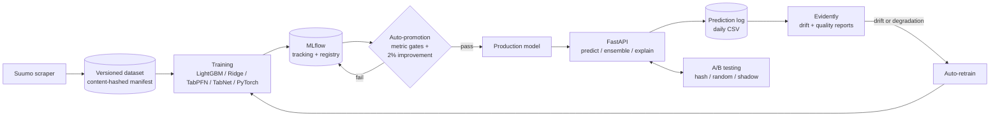

# Tokyo Apartment Rent Predictor

[](https://github.com/jocobtt/rent_scrape/actions/workflows/ci.yaml)

An end-to-end MLOps system that predicts monthly rent for Tokyo apartments from
listings scraped off [Suumo](https://suumo.jp/). The model is the small part. The
project is about everything around it: training, a model registry with
metric-gated promotion, A/B testing, drift monitoring, automated retraining, and
infrastructure as code.

**Stack:** FastAPI · LightGBM · scikit-learn · PyTorch · TabPFN · TabNet · MLflow · Evidently · Docker · Terraform (GCP Cloud Run) · GitHub Actions

## How it fits together



## Design decisions

- **Promotion is gated, not manual.** A new model version only reaches Production if it
  clears absolute thresholds (RMSE, R², MAPE per model family) *and* beats the current
  Production model by at least 2%. The old version is archived, and rollback is one call.
  See [`docs/AUTO_PROMOTION_GUIDE.md`](docs/AUTO_PROMOTION_GUIDE.md).
- **Experiments use statistics, not eyeballing.** The A/B framework supports
  hash-based assignment (a user always sees the same arm), random assignment, and
  shadow mode (both models predict, only control is returned). Results are analysed
  with t-tests, Mann-Whitney U and Cohen's d, and the winner can be promoted in the
  registry. See [`docs/AB_TESTING_GUIDE.md`](docs/AB_TESTING_GUIDE.md).
- **Every prediction is logged**, which is what makes drift detection and later
  ground-truth joins possible. Drift or performance decay triggers retraining, and the
  retrained model still has to pass the promotion gates.
  See [`docs/MONITORING_GUIDE.md`](docs/MONITORING_GUIDE.md).
- **Datasets are versioned** with a content hash and a manifest, so any model can be
  traced back to the exact data it was trained on.
- **Admin actions are protected.** Training, promotion, rollback, cleanup and A/B
  management require an `X-API-Key` header and fail closed if no key is configured.
  CORS is deny-by-default. The Cloud Run service is private unless you opt in.
- **Several model families behind one interface**, from a ridge baseline to TabPFN.
  Each gets its own registry entry and thresholds, so a flashier model has to earn its
  place against the baseline.

## Quickstart

Requires Docker.

```bash
git clone https://github.com/jocobtt/rent_scrape.git && cd rent_scrape
cp .env.example .env
# set ADMIN_API_KEY in .env, e.g.  openssl rand -hex 32
docker compose up -d
```

- API and interactive docs: <http://localhost:8000/docs>
- MLflow UI: <http://localhost:5001>

The repo ships two small **demo** models (LightGBM and Ridge) trained on synthetic data, so
`/predict` works immediately. Their outputs are not market estimates. Regenerate them any
time with `cd api && uv run python scripts/bootstrap_demo_models.py`, or train on real data
(below). If port 8000 is taken, run `API_PORT=8001 docker compose up -d`.

```bash
curl -s localhost:8000/predict -H 'content-type: application/json' -d '{
  "sqr_m": 30, "rei_price": 2, "shikikin": 2,
  "maintenence_price": 1, "year_built": 10, "floor": 3, "eki_walk": 8
}'
# rei_price and shikikin are optional; leave them out when the terms aren't set yet
```

Prediction is in 万円 (10,000 yen) per month. Admin endpoints need the key:

```bash
curl -s -X POST localhost:8000/models/check-promotion -H "X-API-Key: $ADMIN_API_KEY"
```

### Run locally without Docker

```bash
cd api
uv sync
export MLFLOW_TRACKING_URI=http://localhost:5001   # or sqlite:///mlflow.db
./start_api.sh
uv run pytest tests/ -m "not integration"
```

### Get data and train

Scraped listings are not redistributed. See [`data/README.md`](data/README.md) to
regenerate them, then:

```bash
cd api
uv run python scripts/scrape_and_train.py        # scrape, version the dataset, train + register
```

The per-model scripts (`models/challenger_model.py`, `models/reg_model.py`,
`models/tabular_pretrained_model.py --model all`) can be run individually against a CSV in
the schema from `data/README.md`. Each logs to MLflow and then runs the promotion check.

## Results

Trained on one scrape of **27,327 listings** from **6,784 buildings** across all 23 wards
(30,308 raw rows; duplicates and implausible rows removed). Rent is predicted in 万円
(10,000 yen), so an RMSE of 3.6 means a typical miss of about ¥36,000/month.

Hyperparameters were found once (20 Optuna trials per family, on one split) and then replayed
on 5 different splits with `api/scripts/multiseed_eval.py`, because a single split turned out
to be too noisy to rank models on: with identical parameters, LightGBM's RMSE ranged from 2.6
to 6.1 depending on which buildings were held out. Every split holds out 20% of the data
by group, so no group appears in both train and test.

**Holding out whole buildings** (5 splits, mean ± sd):

| Model | RMSE | R² | MAPE |
| --- | --- | --- | --- |
| TabPFN (8,000-row tail-weighted context) | **2.70 ± 1.09** | **0.971 ± 0.016** | **2.7%** |
| PyTorch MLP ensemble | 2.79 ± 0.29 | 0.968 ± 0.008 | 7.3% |
| PyTorch MLP | 3.08 ± 0.41 | 0.961 ± 0.013 | 8.3% |
| LightGBM | 3.64 ± 1.37 | 0.947 ± 0.030 | 6.8% |
| Linear regression | 5.02 ± 0.60 | 0.899 ± 0.023 | 15.8% |
| TabNet | 5.15 ± 1.69 | 0.895 ± 0.048 | 10.2% |

**Holding out whole street blocks** (grouping by the `address` field, which is a block, not a
building: 2,044 addresses vs 6,781 buildings; 5 splits, TabPFN 2):

| Model | RMSE | R² | MAPE |
| --- | --- | --- | --- |
| PyTorch MLP ensemble | 3.55 ± 0.31 | 0.927 ± 0.030 | 8.6% |
| LightGBM | 3.66 ± 0.57 | 0.927 ± 0.016 | 8.1% |
| TabPFN | 4.31 ± 0.95 | 0.893 ± 0.055 | 3.6% |
| Linear regression | 5.18 ± 0.56 | 0.848 ± 0.059 | 16.2% |

**What the two tables say together**

- **The ranking depends on how strict the hold-out is.** LightGBM and the linear model barely
  move (3.64 → 3.66, 5.02 → 5.18). The PyTorch ensemble loses 0.8 RMSE and TabPFN loses 1.6:
  these models make use of other buildings on the same block that were in training. That is
  a legitimate signal if you price listings on blocks you have seen, and optimistic if you
  price a new area. Neither table answers "a new unit in a building already in the data",
  which a random split would (and which would be easier still).
- **TabPFN is the best model only when its neighbours are in the training data.** Under the
  stricter split it is behind LightGBM and the neural ensemble on RMSE. It keeps the best MAPE
  in both tables: it is accurate on typical listings and misses the expensive ones.
- **Deep models are not clearly better than LightGBM** once blocks are held out (3.55 vs 3.66,
  well inside one standard deviation). The gap in the first table is mostly neighbourhood
  memorisation.
- **Variance is large for LightGBM and TabNet** (sd 1.4 and 1.7 on the building split). Their
  errors are dominated by which expensive buildings land in the test set. The neural
  ensemble is steadier (sd 0.3).
- **TabNet is the weakest and least stable model**, and tuning it made it worse on the
  original split (RMSE 5.11 vs 4.71 untuned): 20 trials scored on one validation slice
  overfit the slice. Fixing it needs grouped CV inside each trial.
- **Tuning the linear baseline did nothing** (grouped-CV RMSE 5.09 vs 5.10). It is limited by
  capacity, not variance.
- **Caveat on tuning leakage:** hyperparameters were chosen on the training part of one split
  (seed 42), and the other splits' test buildings overlap that training part. This favours
  every tuned family slightly. It does not affect the ranking between families much, but the
  absolute numbers are a little optimistic.
- **Why grouped at all:** one building lists many near-identical units. A random split lets a
  flexible model memorise siblings (on an early 900-row development sample, LightGBM scored R²
  0.999 on a random split and 0.638 grouped). Split logic is in `api/services/data_split.py`.
- LightGBM cross-validation (5 grouped folds, training data only): R² 0.914 ± 0.032, RMSE
  4.35 ± 1.05. A quarter of its training rows have deposit/key money hidden, which makes the
  folds harder.

**Registry state.** Promotion gates were calibrated on the first split (seed 42), where every
family below passed:

| Model | RMSE | R² | MAPE | Registry |
| --- | --- | --- | --- | --- |
| PyTorch MLP ensemble | 3.12 | 0.966 | 7.4% | Production |
| LightGBM | 3.59 | 0.955 | 6.7% | Production |
| Linear regression | 4.53 | 0.928 | 16.2% | Production |
| TabPFN | 4.79 | 0.919 | 2.8% | Production (clears its 4.8 gate by 0.01) |
| TabNet | 5.11 | 0.908 | 9.1% | Production |

The PyTorch MLP (3.50 / 0.957 / 8.9%) is registered but not promoted: the ensemble beats it.
Given the split-to-split noise above, a 2% improvement over Production (the promotion rule) is
well inside the noise for any single run. Treat promotion as a sanity check, not as evidence
that one version is better.

### Caveat: deposit and key money are near-leaky inputs

`shikikin` (deposit) and `rei_price` (key money) are the strongest features, and in this data
the deposit **equals the rent in 58% of listings**. A rent estimate that needs the deposit is
only useful once the landlord has already set the price, so both are **optional** in the API
(`/predict`, `/challenger_predict`, `/compare_predictions` and the A/B routes). Omit them and
you get the number to expect for a listing whose terms aren't set yet.

How a missing value is handled:

- **Both omitted → dedicated model.** `/predict` and `/challenger_predict` route to a model
  trained without the two columns (`tokyo_rent_lgbm_noterms`, `tokyo_passed_rent_noterms`).
  The response says which one answered (`"variant": "no_terms"` or `"shared"`).
- **Only one given → shared model.** LightGBM receives NaN natively and is trained with
  deposit and key money hidden (together) on 25% of rows, so it copes. Without that masking
  it is unusable on missing values (R² 0.52 on the same split). The linear model gets the
  training median.

Terms given vs omitted, held-out buildings, 5 splits (mean ± sd RMSE):

| Model | RMSE with terms | RMSE without | R² without |
| --- | --- | --- | --- |
| LightGBM, shared (25% masked) | 3.64 ± 1.37 | 6.46 ± 1.96 | 0.839 |
| LightGBM, dedicated no-terms | n/a | 6.28 ± 2.19 | 0.846 |
| Linear, shared (median-imputed) | 5.02 ± 0.60 | 8.63 ± 1.76 | 0.710 |
| Linear, dedicated no-terms | n/a | 6.62 ± 1.16 | 0.828 |

- **Linear:** the dedicated model is clearly better (6.62 vs 8.63; 6.09 vs 7.19 when blocks
  are held out).
- **LightGBM:** the dedicated and shared models are indistinguishable (6.28 vs 6.46 against a
  sd of about 2; 5.28 vs 5.36 when blocks are held out). An earlier untuned comparison favoured
  the dedicated model by 0.4–0.7 RMSE, and it did not survive tuning both. The dedicated
  LightGBM is kept because routing is tested and cheap, but it costs a registry entry for no
  measurable gain and could be dropped.
- Dropping deposit and key money costs roughly 2.5–3 RMSE for every model. That is the real
  accuracy of pricing a listing before its deposit terms are set.

The ensemble, PyTorch and explain endpoints still require both fields and return 422 without
them.

Evaluation reports (CV folds, residual analysis, learning curves) are written to
`api/evaluation_reports/` on every training run.

## Repository layout

```
api/
  model_api.py          FastAPI app (predict, ensemble, explain, A/B, promotion, monitoring)
  scheduled_tasks.py    promotion checks, drift checks, reports, monthly scrape/retrain
  models/               training scripts per model family
  services/             promotion, retraining, A/B, drift, lineage, SLA, explainability, MLflow
  scripts/              scrape_and_train.py (CI + local)
  tests/
data/                   dataset schema + how to regenerate
docs/                   guides for promotion, A/B testing, monitoring, MLflow
tf/                     Terraform for Cloud Run + GCS
env/                    Kubernetes manifests (alternative deployment)
.github/workflows/      CI, image build + scan, monthly retraining, security scan
```

## CI/CD

- **CI**: tests on every push and PR.
- **Image build**: builds, scans and pushes the API image. It needs a `GCP_PROJECT_ID`
  repository variable and the registry credentials as secrets.
- **Retraining**: monthly scheduled workflow (also manually triggerable) that scrapes,
  versions the data, retrains and uploads the datasets and models as artifacts.
- **Security scan**: dependency and static analysis.

## Deploying to Cloud Run

```bash
cd tf
cp terraform.tfvars.example terraform.tfvars   # set project_id, admin_api_key, invoker_members
terraform init && terraform plan
```

The service is private by default. Set `invoker_members` to the identities that may call
it, or `allow_public_access = true` if the API's own key auth is enough for you.

## Limitations and next steps

Honest scope notes:

- **One snapshot.** The dataset is a single scrape (2026-10-07/08). A time-based split and
  real drift monitoring need a second scrape; new scrapes carry `scraped_at` for that.
- **Near-leaky inputs.** Deposit / key money are optional, but accuracy drops sharply without them (RMSE 3.6 → 6.7). See the caveat above.
- **Tuning is shallow.** Every family got a small, comparable search (20 trials, or four context
  configurations for TabPFN), single seed, single validation scheme. TabNet's result shows the
  risk. These are demonstrations of the pipeline, not best-effort models.
- **Heuristic recommendation endpoints** (`/ensemble/recommendations`, `/torch/recommendations`)
  still use yen-scale cut-offs and treat `year_built` as a calendar year. They don't affect
  predictions, but their output is not meaningful yet.
- **Registry stages** are deprecated upstream in MLflow; moving to aliases is planned.
- **Auth:** a shared API key guards admin routes. That is fine for a demo, not for
  multi-tenant use. Real deployments should use JWT or IAM.

Roadmap:

- [x] Grouped (by building) evaluation splits
- [x] Larger scrape (27k listings, 23 wards)
- [ ] Second scrape snapshot, then time-based splits and a real drift report
- [x] Recalibrate promotion thresholds on grouped scores (万円)
- [x] Make deposit / key money optional inputs and report the without-deposit accuracy
- [x] Dedicated no-terms models (LightGBM, linear), served when both fields are omitted
- [ ] Optional deposit / key money for the ensemble, PyTorch and explain endpoints
- [ ] Fix the yen-scale logic in the recommendation endpoints
- [x] Tune LightGBM with the same Optuna budget
- [x] Log MAPE and register the PyTorch models so the promotion gates apply
- [x] Tune TabNet, TabPFN and the linear baseline (TabNet got worse; see notes)
- [x] Multi-seed results (5 splits), plus a stricter street-block hold-out
- [ ] Grouped CV inside each TabNet trial
- [ ] Re-tune each family on a split that excludes every evaluation split
- [ ] Data quality checks on ingest (Great Expectations or similar)
- [ ] Geocoding and neighbourhood features
- [ ] Split `model_api.py` into routers; add lint, type-check and coverage gates
- [ ] Pre-commit hooks and a deployment runbook
- [ ] MLflow aliases instead of stages
- [ ] JWT auth

## Documentation

[API reference](docs/API_README.md) · [MLflow setup](docs/MLFLOW_IMPLEMENTATION.md) ·
[Auto-promotion](docs/AUTO_PROMOTION_GUIDE.md) · [A/B testing](docs/AB_TESTING_GUIDE.md) ·
[Monitoring](docs/MONITORING_GUIDE.md) · [Monitoring quickstart](docs/QUICKSTART_MONITORING.md) ·
[Logging](api/LOGGING_GUIDE.md)

## Frontend

The D3.js / Vue front end lives in a separate repo:
[jocobtt/rent_d3](https://github.com/jocobtt/rent_d3).
